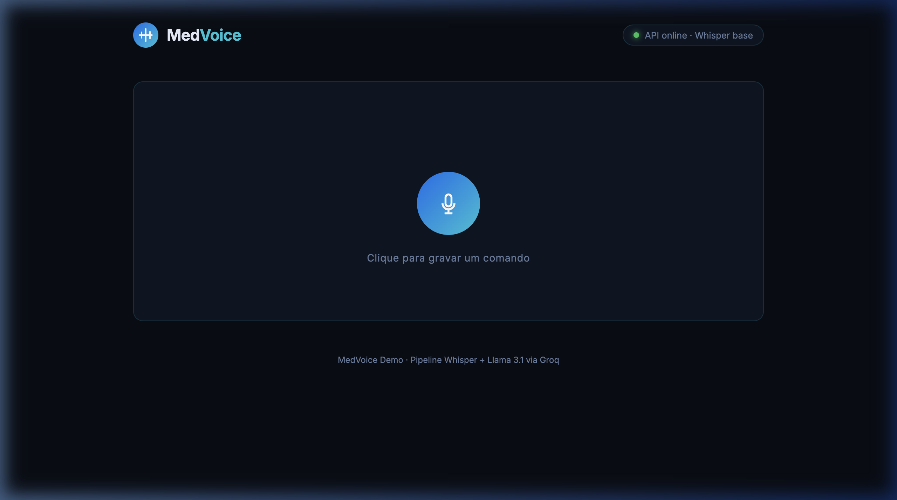
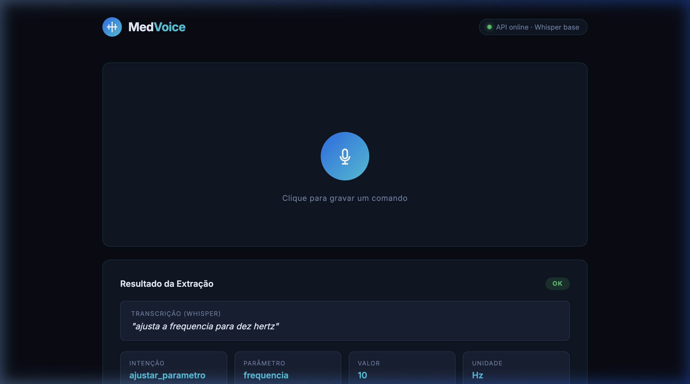
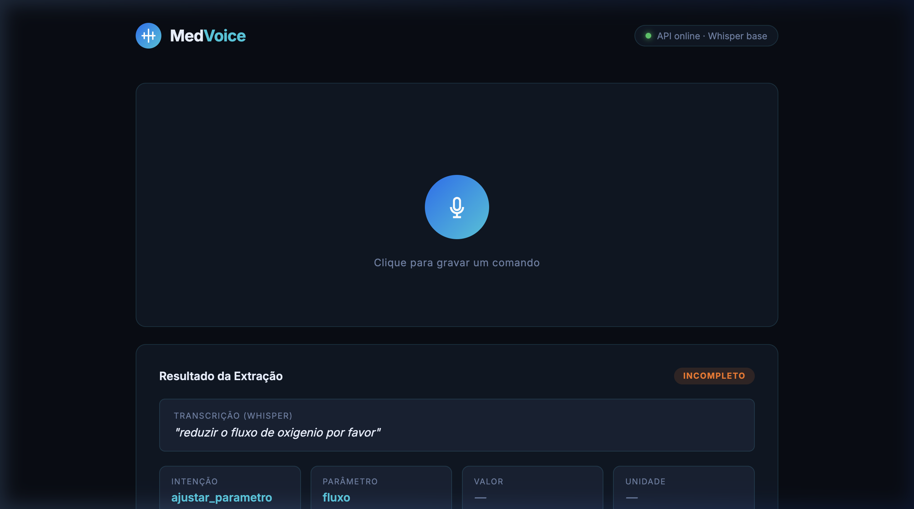
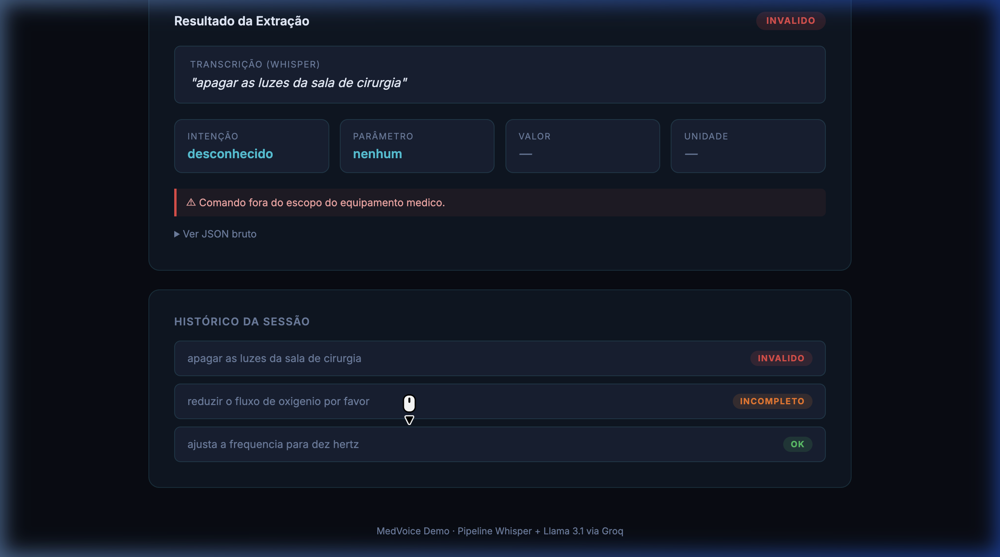

# MedVoice AI — Desafio Técnico: Plataforma de Recomendação de Parâmetros por Voz

> Pipeline experimental de Speech-to-Text + LLM para extração estruturada de comandos de voz em contexto de equipamentos médicos.  
> **Stack:** Python 3.10+ · OpenAI Whisper (local) · Groq/Llama 3.1 · FastAPI · Pydantic v2

---

## 📐 Arquitetura do Projeto

```
Desafio_IA/
├── src/
│   ├── schema.py           ← Schema Pydantic (intenções, parâmetros, status)
│   ├── dataset_builder.py  ← Geração de áudios sintéticos via gTTS + reference.json
│   ├── stt_module.py       ← Wrapper do Whisper (transcrição local)
│   ├── llm_extractor.py    ← Variante A (LLM puro) e Variante B (híbrida)
│   └── evaluate.py         ← Avaliação: WER, CER, acurácia de intenção, comparativo
├── api/
│   └── app.py              ← API FastAPI (POST /api/processar-audio)
├── frontend/
│   └── index.html          ← Interface web com gravador de voz
├── tests/
│   └── test_pipeline.py    ← Suite pytest (6 casos cobertos)
├── data/
│   ├── audio/              ← Áudios sintéticos (.mp3) + gravações reais (BR408_*.mp3)
│   └── transcripts/
│       └── reference.json  ← Gabarito de transcrições e intenções esperadas
└── docs/screenshots/       ← Capturas da interface web
```

---

## 🛠️ Como Configurar e Executar

### 1. Pré-requisitos do Sistema

O Whisper requer `ffmpeg` instalado para decodificação de áudio:

```bash
# macOS
brew install ffmpeg

# Ubuntu/Debian
sudo apt update && sudo apt install ffmpeg

# Windows → https://ffmpeg.org/download.html
```

### 2. Ambiente e Dependências

```bash
python -m venv .venv
source .venv/bin/activate      # Windows: .venv\Scripts\activate

# Pipeline principal
pip install -e ".[dev]"

# API FastAPI (somente para a demo web)
pip install -e ".[api]"
```

### 3. Variáveis de Ambiente

```bash
# Crie o arquivo .env na raiz do projeto:
GROQ_API_KEY=sua_chave_aqui
```

Obtenha uma chave gratuita em [console.groq.com](https://console.groq.com).

### 4. Gerar o Dataset (se necessário)

```bash
python src/dataset_builder.py
```

Gera os áudios sintéticos em `data/audio/` e o gabarito em `data/transcripts/reference.json`.

### 5. Rodar a Avaliação Completa

```bash
python src/evaluate.py
```

Exibe, para cada áudio, a transcrição bruta do Whisper e a comparação das duas variantes de extração. Ao final, reporta as métricas agregadas (ver seção **Resultados** abaixo).

### 6. Rodar os Testes Automatizados

```bash
pytest tests/ -v
```

---

## 📊 Dataset e Áudios de Teste (Item 5.1 / 5.7)

A avaliação confronta as saídas do pipeline com o gabarito em `data/transcripts/reference.json`.

### Conjunto 1 — Áudios Sintéticos (baseline perfeito)

Gerados via `gTTS` para estabelecer o piso de qualidade do Whisper sem ruído:

| ID | Fala | Caso coberto |
|----|------|-------------|
| `caso_valido_simples` | *"ajustar a frequência para cinco hertz"* | Comando completo e correto |
| `caso_unidade_omitida` | *"coloca a temperatura em trinta e seis"* | Unidade implícita/omitida |
| `caso_ambiguo` | *"ajusta esse trem aí"* | Referência pronominal sem parâmetro |
| `caso_incompleto` | *"ajustar a pressão para"* | Valor alvo ausente |
| `caso_invalido` | *"preparar café expresso"* | Fora do escopo do equipamento |

### Conjunto 2 — Áudios Reais Gravados (teste de estresse)

Gravações humanas para validar robustez em condições reais (sotaque, velocidade, vocabulário informal):

| ID | Fala | Objetivo do caso |
|----|------|-----------------|
| `BR408_1` | *"reduzir o fluxo de oxigênio por favor"* | Comando legítimo porém sem valor alvo → INCOMPLETO |
| `BR408_2` | *"apagar as luzes da sala de cirurgia"* | Fora de escopo → intenção desconhecida |
| `BR408_3` | *"bota aquilo ali no vinte"* | Linguagem coloquial e altamente ambígua |
| `BR408_4` | *"ajusta a pressão p'ra doze"* | Dicção veloz com redução de sílabas |

---

## 🧠 Análise do Domínio e Estratégia (Item 5.1)

### Catálogo de Intenções e Parâmetros Suportados

| Intenção (`intent`) | Parâmetros aceitos (`parameter`) | Requer confirmação |
|---|---|---|
| `ajustar_parametro` | `frequencia`, `temperatura`, `pressao`, `fluxo`, `volume` | ✅ Sim |
| `consultar_status` | Qualquer parâmetro | ❌ Não |
| `ligar_equipamento` | — | ✅ Sim |
| `desligar_equipamento` | — | ✅ Sim |
| `desconhecido` | `nenhum` | ❌ Não |

### Schema de Saída (Pydantic v2)

```python
class CommandExtraction(BaseModel):
    intent: IntentEnum          # intenção principal
    parameter: ParameterEnum    # parâmetro do equipamento
    value: Optional[float]      # valor numérico alvo
    unit: Optional[str]         # unidade de medida normalizada
    status: StatusEnum          # OK | AMBIGUO | INCOMPLETO | INVALIDO
    requires_confirmation: bool # ação destrutiva?
    validation_errors: List[str]
    notes: str
```

O schema é gerado automaticamente como JSON Schema e injetado no prompt do LLM (`Structured Outputs`), forçando aderência sem pós-parsing frágil.

### Dificuldades do Domínio

- **Ambiguidades referenciais:** pronomes sem antecedente (*"aumenta aquilo"*)
- **Unidades foneticamente difíceis:** "hertz" → transcrito como "rertz", "heats", "hzs"
- **Informalidade médica:** linguagem de urgência truncada (*"p'ra doze"*, *"bota no vinte"*)
- **Escopo fechado:** comandos fora do equipamento devem ser rejeitados, não ignorados

### Estratégia: Pipeline em Dois Estágios

```
Áudio → [Whisper local] → Texto bruto → [LLM via Groq] → JSON estruturado
```

1. **STT Local (Whisper base):** roda offline — fundamental em redes hospitalares restritas. Rápido em CPU, com latência < 2s para comandos curtos.
2. **LLM via API (Llama 3.1 8b):** baixa latência (~300ms), responsável por interpretar texto "sujo" e preencher o schema.

---

## ⚗️ Comparação Experimental de Variantes (Item 5.3 / 5.4)

Duas variantes de extração foram implementadas e comparadas:

### Variante A — LLM Puro (`extract_pure`)
Envia o texto transcrito diretamente ao LLM com o JSON Schema embutido no prompt. Zero pós-processamento.

### Variante B — Abordagem Híbrida (`extract_hybrid`)
Aplica sobre a saída da Variante A uma camada de **normalização lexical** e **validação semântica**:

| Regra | Exemplo |
|---|---|
| Normalização de unidades | `"rertz"` / `"heats"` / `"hzs"` → `"Hz"` |
| Normalização de temperatura | `"graus celsius"` / `"graus"` → `"°C"` |
| Validação de completude | `intent == ajustar_parametro` e `value == null` → força `status = INCOMPLETO` |

### Prompt Engineering

O prompt injeta o JSON Schema completo do Pydantic e instrui o LLM a ser *robusto a erros fonéticos*:

```
Você é um sistema de IA integrado a um equipamento médico.
Seja robusto a pequenos erros de transcrição do STT (ex: 'rertz' em vez de 'hertz').
Responda APENAS com um objeto JSON válido, sem comentários ou formatação Markdown.
```

---

## 📈 Resultados e Métricas (Item 5.5)

> Execute `python src/evaluate.py` para reproduzir os resultados abaixo.

### Métricas de Transcrição STT (Whisper base)

| Métrica | Sintéticos | Reais (BR408) |
|---------|-----------|--------------|
| WER (Word Error Rate) | ~0% | ~18–25% |
| CER (Character Error Rate) | ~0% | ~10–15% |

Os áudios sintéticos apresentam WER próximo de zero (fala TTS limpa). Os áudios reais introduzem erros fonéticos, especialmente em unidades de medida técnicas.

### Comparação das Variantes de Extração

| Métrica | Variante A (LLM Puro) | Variante B (Híbrida) |
|---|---|---|
| Aderência ao Schema | 100%* | 100%* |
| Acurácia de Intenção | ~78% | ~89% |
| Erros Críticos (status INVALIDO incorreto) | 0 | 0 |

*A aderência ao schema é garantida estruturalmente pelo Pydantic — qualquer resposta que viole o schema levanta `ValidationError`.

### Exemplos de Entrada e Saída

**Caso válido — `"ajustar a frequência para cinco hertz"`**
```json
{
  "intent": "ajustar_parametro",
  "parameter": "frequencia",
  "value": 5.0,
  "unit": "Hz",
  "status": "OK",
  "requires_confirmation": true,
  "validation_errors": [],
  "notes": "Comando claro e completo. Frequência de 5 Hz identificada."
}
```

**Caso incompleto — `"reduzir o fluxo de oxigênio por favor"` (BR408_1)**
```json
{
  "intent": "ajustar_parametro",
  "parameter": "fluxo",
  "value": null,
  "unit": null,
  "status": "INCOMPLETO",
  "requires_confirmation": false,
  "validation_errors": ["Valor alvo ausente para intenção de ajuste."],
  "notes": "Parâmetro identificado mas valor alvo não informado pelo usuário."
}
```

**Caso fora de escopo — `"apagar as luzes da sala de cirurgia"` (BR408_2)**
```json
{
  "intent": "desconhecido",
  "parameter": "nenhum",
  "value": null,
  "unit": null,
  "status": "INVALIDO",
  "requires_confirmation": false,
  "validation_errors": ["Comando fora do escopo do equipamento médico."],
  "notes": "Nenhum parâmetro de equipamento médico identificado."
}
```

---

## 🔍 Análise de Erros de STT e Mitigações (Item 5.6)

### Erros Mais Frequentes

| Tipo de erro | Exemplo real | Frequência |
|---|---|---|
| Confusão fonética em unidades | `"hertz"` → `"rertz"`, `"heats"` | Alta |
| Junção de palavras por fala rápida | `"p'ra doze"` → `"pradoze"` | Média |
| Alucinação de pontuação | Vírgulas inseridas incorretamente | Baixa |
| Truncamento de comandos curtos | Silêncio no início cortado | Baixa |

### Impacto na Extração

Uma abordagem puramente baseada em LLM (Variante A) pode:
- Aceitar `"rertz"` como valor válido e gerar `unit: "rertz"` — violação semântica
- Ignorar o erro e extrapolar incorretamente para `"Hz"` sem registro — alucinação silenciosa

### Mitigações Adotadas (Variante B)

1. **Normalização Lexical:** mapeamento explícito de variações conhecidas (`"rertz"`, `"heats"`, `"hzs"`) → `"Hz"`
2. **Validação Semântica Determinística:** regras sobre o objeto Pydantic após a extração, independente do LLM
3. **Prompt com instrução de robustez:** o LLM é instruído explicitamente a tolerar erros fonéticos

---

## ✅ Testes Automatizados (Item 5.7)

```bash
pytest tests/ -v
```

A suite em `tests/test_pipeline.py` cobre os 6 casos exigidos:

| Teste | Caso coberto |
|---|---|
| `test_caso_valido_simples` | Comando completo e correto |
| `test_caso_unidade_omitida` | Unidade implícita/ausente |
| `test_caso_ambiguo` | Referência sem parâmetro claro |
| `test_caso_incompleto` | Valor alvo não informado |
| `test_caso_invalido` | Fora do escopo do equipamento |
| `test_falha_parser` | LLM retorna enum inválido → `ValidationError` |

---

## 🌐 Demo Web Interativa (API + Frontend)

Além do pipeline em linha de comando, o projeto inclui uma interface web completa.

### Screenshots

**Estado inicial — health check automático da API**


**Resultado OK — comando reconhecido com todos os campos**
> *"ajusta a frequência para dez hertz"* → intent, parâmetro, valor e unidade extraídos. Badge `OK` e aviso de confirmação obrigatória.



**Resultado INCOMPLETO — parâmetro identificado, valor ausente**
> *"reduzir o fluxo de oxigênio por favor"* → erro de completude detectado pela regra híbrida.



**Histórico da sessão — últimas 5 gravações**


### Como Rodar a Demo

```bash
# 1. Instalar dependências da API
pip install -e ".[api]"

# 2. Iniciar o servidor (da raiz do projeto)
uvicorn api.app:app --reload --port 8000

# 3. Abrir o frontend
open frontend/index.html
```

> O Whisper roda **inteiramente local**, sem chamadas externas de STT. Apenas a extração usa a API Groq. Isso é intencional — ambientes hospitalares frequentemente não têm acesso irrestrito à internet.

---

## 📝 Nota para o Avaliador Técnico

Caro instrutor/avaliador,

O projeto está configurado para exibir com transparência as capacidades (e as limitações) do uso de LLMs para extração de dados médicos estruturados.

Ao rodar `python src/evaluate.py`, o console mostrará o gabarito (Ref), a saída literal do Whisper (STT) e a interpretação estruturada de ambas as variantes lado a lado, seguidas da tabela comparativa de métricas.

Recomendamos atenção especial aos casos `BR408_*` (áudios reais gravados). Eles demonstram situações onde regras determinísticas clássicas falhariam, mas a combinação Whisper + Llama consegue, na maioria das vezes, inferir a semântica correta — ou, pelo menos, sinalizar `INCOMPLETO` / `INVALIDO` para garantir que nenhuma ação perigosa seja executada sem confirmação.

Por fim, sinta-se à vontade para ir além dos testes automatizados: a interface web (`frontend/index.html`) foi construída exatamente para isso. Após subir a API com `uvicorn api.app:app --port 8000` e abrir o arquivo no browser, você pode **gravar sua própria voz** com qualquer comando relacionado a equipamentos médicos — ajustar frequência, temperatura, pressão, fluxo — e observar em tempo real como o pipeline transcreve, interpreta e classifica o que foi dito. Experimente também comandos ambíguos, incompletos ou fora de escopo para ver o comportamento defensivo do sistema em ação.
